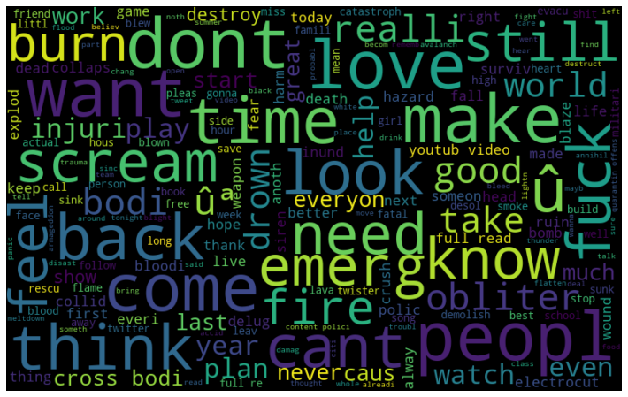
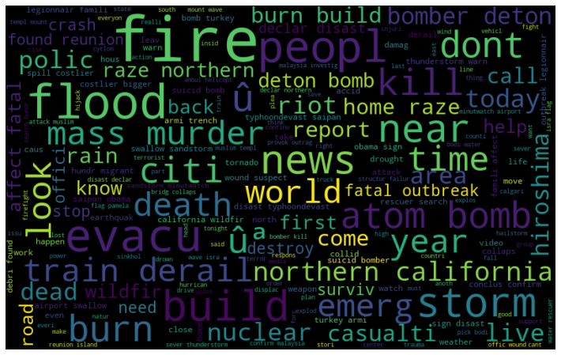

# Disaster Text Classification using BERT

## Background
X (Formerly known as Twitter) has become an important communication channel in times of emergency. The ubiquitousness of smartphones enables people to announce an emergency they’re observing in real-time. Because of this, more agencies are interested in programatically monitoring Twitter (i.e. disaster relief organizations and news agencies).
The goal is to identify and build a BERT model here predicts which Tweets are about real disasters and which one’s aren’t. To identify potential distasters before they are even reported.

## Business Problem
The goal is to identify and build a BERT model here predicts which Tweets are about real disasters and which one’s aren’t. To identify potential distasters before they are even reported.

## Data
The Dataset comes from Kaggle Competition,  "Natural Language Processing with Disaster Tweets"

## Methods
Removal of special characters (@,#, etc.)

Applying NLP Techniques such as Stemming, Lemmatization, and Tokenization.

Removal of small words (less than 3 characters in length)

Removing stop words

Build WordClouds - Visualization of most common and important words.

Build machine learning models with Word Vectorizers to predict future disasters using BERT as well as using CountVectorizer and Term Frequency - Inverse Document Frequency (TFIDF).

Developed several models to evaluate performance
• Precision – correct predictions vs total predictions
• Recall – Correct predictions vs actual positive predictions
• F1 score – harmonic mean of Precision and Recall • Accuracy

Count Vectorizer counts the number of times a word appears.

TFIDF (Term Frequency - Inverse Document Frequency counts the number of words but considers the overall document weightage

## Results
WordCloud for NEGATIVE Target Classification

Wordcloud for POSITIVE Target Classification

## Conclusions / Summary of Findings
THE BERT MODEL(TFBertForSequenceClassification) does a great job, the TFIDF model comes as a close second and the CountVectorizer Model is the third best

Next steps...

Collect data within 6 months to evaluate model performance

Based on the texts, make improvements to to model to more accurately improve model performance

## Next Steps...

1) Collect data within 6 months to evaluate model performance

2) Based on the texts, make improvements to to model to more accurately improve model performance

├── data : data used for modeling

├── images : images used in PPT and readme

├── README.md : project information and repository structure

